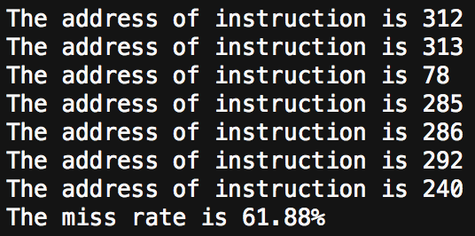

# OS-Assignment2

## 简介

我选择的是第二题：请求分页分配方式，使用 LRU 算法进行内存置换。

## 什么是 LRU？

LRU是Least Recently Used的缩写，即最近最久未使用，常用于页面置换算法，是为虚拟页式存储管理服务的。

关于操作系统的内存管理，如何节省利用容量不大的内存为最多的进程提供资源，一直是研究的重要方向。而内存的虚拟存储管理，是现在最通用，最成功的方式——在内存有限的情况下，扩展一部分外存作为虚拟内存，真正的内存只存储当前运行时所用得到信息。这无疑极大地扩充了内存的功能，极大地提高了计算机的并发度。虚拟页式存储管理，则是将进程所需空间划分为多个页面，内存中只存放当前所需页面，其余页面放入外存的管理方式。

## 数据结构

`Node` 

```javascript
/**
 * Node 节点是每一条指令的封装，包含 prev 和 next 指针和 value 地址值
 */
class Node {
	constructor(value) {
		this.prev = null;
		this.next = null;
		this.value = value;
	}
}
```

`LRUCache`

```javascript
/**
 * LRUCache 是内存的抽象，是一个 LinkedHashMap
 */
class LRUCache {
	constructor(cap) {
		this.head = new Node(-1),
			this.tail = new Node(-1);
		this.mem = new Map();
		this.miss = 0;
		this.cap = cap;

		this.head.next = this.tail;
		this.tail.prev = this.head;
	}
}
```

## 使用方式

在项目根目录中输入并回车：

```javascript
$ node memory.js
```

即可在 terminal 中看到输出的结果。

## 部分运行截图



